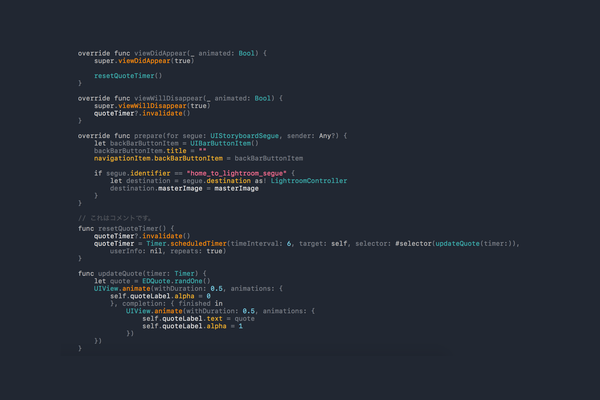

# Tokyo

#### A Theme For Xcode 

### Updated for XCode 11

- Use SF Mono medium as base font
- Use SF Mono bold for keywords
- Use Helvetica for documentation markup
- Update screenshot showing SwiftUI code

#### 

###### How to Use

1. Clone or download the project as zip.
2. Copy Tokyo.xccolortheme into ~/Library/Developer/Xcode/UserData/FontAndColorThemes/
3. Restart XCode if theme does not appear in Preference.
4. Done.

